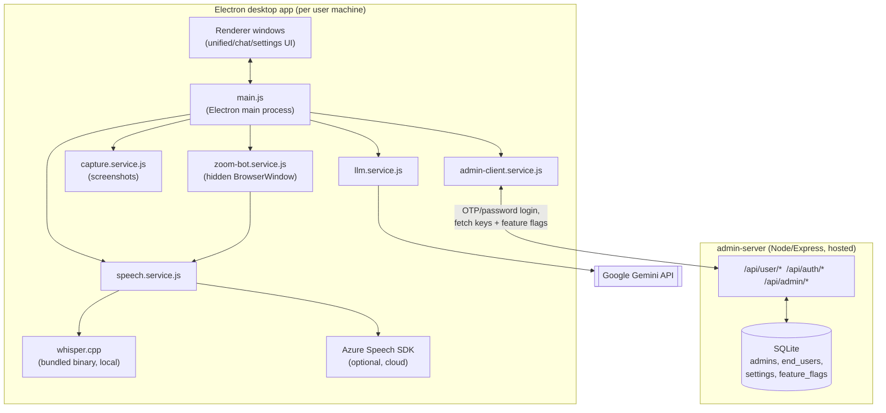

# Architecture

This explains how Meeting Copilot actually works end to end: the desktop
app's internals, the admin panel it talks to, and how the two are wired
together. For "how do I deploy this," see [DEVOPS.md](DEVOPS.md).

## System overview

The desktop app never talks to the admin panel's database directly — only
through its HTTP API, and only to fetch its own config or sign in.

## Electron app internals

### Process model

- **`main.js`** is the Electron main process and the orchestrator for
  everything: app lifecycle (`onAppReady`), IPC handlers
  (`ipcMain.handle`/`ipcMain.on`), and the glue between every service below.
- **`preload.js`** exposes a narrow `contextBridge` API to renderer windows
  (context isolation is on, `nodeIntegration` is off — renderers never get
  raw Node/Electron access).
- **`src/managers/window.manager.js`** owns every window's lifecycle
  (`unified`, `chat`, `settings`, `onboarding`, `accountLogin`,
  `llmResponse`, ...), each a small frameless `BrowserWindow` with its own
  config in `windowConfigs`. It also handles always-on-top enforcement,
  stealth/privacy mode, and multi-desktop visibility (macOS Spaces).
- **`src/managers/session.manager.js`** is the in-memory conversation/event
  log for the current session: transcript turns, model responses, active
  skill, current mode (`meeting`/`interview`/etc.), used to build LLM
  context and to feed the end-of-session summary/MoM generation. It
  self-compacts (`performMaintenance`) so a long meeting doesn't grow
  memory unbounded.
- **`src/core/config.js`** holds static app defaults (window sizes, Gemini
  model name, Whisper tuning constants) as a plain nested object, read via
  dotted-path `config.get('llm.gemini.model')`.
- **`src/core/first-run.js`** drives the onboarding wizard for a user who
  isn't signed in yet (see below).

## Speech pipeline

1. **Capture**: mic + system audio are captured (`speech.service.js`, with
   `fallback-capture.service.js` as a backup path on platforms/setups where
   the primary capture method isn't available).
2. **Voice-activity detection (VAD)**: instead of cutting audio on a blind
   timer, `config.speech.whisper` tunes an adaptive-noise-floor VAD that
   flushes an "utterance" when the speaker pauses (`silenceHangoverMs`),
   with a hard ceiling (`maxUtteranceMs`) so a monologue still gets
   transcribed incrementally. This keeps transcription aligned to natural
   sentence boundaries instead of splitting mid-word.
3. **Transcription** — one of two interchangeable backends, chosen by the
   admin-configured `speechProvider` setting:
   - **`whisper-cpp-worker.service.js`** (default): spawns the bundled
     `whisper.cpp` binary (`resources/whisper-cpp/<platform>/`) as a
     one-shot process per utterance. Fully offline, ships inside the
     installer, no per-request cost. Model file resolution has a fallback
     (`resolveBundledModel`): if the exact expected filename for the
     configured language isn't bundled, it scans the models directory for
     whatever *was* actually bundled rather than hard-failing — see the
     "Known limitations" section below for why the model itself still
     isn't live-switchable.
   - **`whisper-worker.service.js`**: the original Python (`openai-whisper`
     + PyTorch) backend, kept for local development where a Python env is
     already set up. Not bundled into installers (would add hundreds of MB
     per platform).
   - **Azure Speech SDK**: cloud-based, fully dynamic (no local model file
     at all), used when an admin sets `speechProvider: azure` and an Azure
     key/region in the dashboard.
4. Transcribed text flows into `main.js`'s `processTranscriptionWithLLM`,
   which is where the LLM pipeline picks it up.

### Zoom bot audio

`zoom-bot.service.js` opens a hidden `BrowserWindow` that joins a Zoom
meeting as a silent participant (`src/preload/zoom-bot-preload.js` runs
inside that page to read the active speaker / participant roster and pipe
audio out via IPC — `zoom-bot-audio-chunk` — into the same
`speech.service.js` pipeline above). This is how the app gets a transcript
of a meeting without needing the user's own mic to be capturing the room.

## LLM pipeline (`llm.service.js`)

All requests go through `GoogleGenAI` (`@google/genai`), with a **primary
SDK path** and a **raw-HTTPS fallback path**
(`executeRequest`/`executeAlternativeRequest`) that retries with the other
method if the first fails — plus a **model fallback chain**
(`llm.gemini.model` → `llm.gemini.fallbackModels`) that moves to the next
model immediately on a 503/overload/rate-limit response instead of burning
all retries on a dead model.

Two different request shapes, depending on context:

- **Skill mode** (`processTextWithSkill`, `processImageWithSkill`): the
  classic "ask a DSA/system-design/etc. question, get a detailed answer"
  flow, with a skill-specific system prompt from `prompt-loader.js` and
  conversation history from `session.manager.js`.
- **Meeting mode** (`processTranscriptionWithIntelligentResponse` +
  **`checkIfQuestionPrompt`**): every transcribed utterance is first run
  through a cheap classification prompt asking "is this a direct question
  the user should answer?" (`checkIfQuestionPrompt`, 5-token response,
  `YES`/`NO`). Only on `YES` does the app trigger the full
  answer pipeline (`executeAskAiHelp`) and show it in the UI — everything
  else is recorded into the transcript silently. This is what keeps the
  overlay from firing on every line of small talk.

Both paths support streaming (`processTranscriptionWithIntelligentResponseStream`,
raw SSE parsing against `:streamGenerateContent`) so the UI can render an
answer as it's generated, falling back to non-streaming on any failure.

**Question detection fails silently by design** — a Gemini error inside
`checkIfQuestionPrompt` is caught and just returns `false` (logged, not
surfaced) rather than crashing the meeting-mode pipeline. This is
convenient for reliability but means a broken/invalid Gemini key looks
exactly like "the app just isn't detecting questions" from the outside —
always check the logs for `[LLM] Question detection failed` before
assuming it's a detection-logic bug.

## Screenshot / Ask AI

`capture.service.js` uses Electron's `desktopCapturer`/`screen` APIs to
grab a screenshot (optionally cropped to a selected area), which
`llm.service.js`'s `processImageWithSkill(Stream)` sends to Gemini as
inline image data alongside the active skill's prompt. Requires the macOS
Screen Recording permission to be granted to the app; a capture failure
logs the real OS-level error (see `main.js`'s `captureScreen`) rather than
failing silently, since this used to be a common source of confusing
support requests.

## Minutes of Meeting & session summary

At end of session, `llm.service.js` has two distinct generators over the
full raw transcript (both single large non-streamed Gemini calls, not
incremental):

- **`generateSessionSummary`** — a narrative recap, diarized by speaker
  when the transcript has real `[Speaker: Name]` tags (from the Zoom bot),
  or with inferred generic labels otherwise.
- **`generateMinutesOfMeeting`** — a formal MoM document: attendees,
  agenda, key discussion points, decisions, and an action-items table with
  owners — a shareable artifact distinct from the narrative summary above.

`src/services/export.service.js` handles getting either of these out of
the app (file export).

## Admin panel integration

This is what makes API keys and feature access centrally managed instead
of something every end user configures themselves.

### On every app launch

1. `main.js`'s `ensureAccountAuthenticated()` runs before onboarding/first-run
   logic. It calls `admin-client.service.js`, which:
   - Uses a cached session JWT if one exists (30-day server-side TTL) —
     not a login-every-launch flow.
   - If no session, blocks on the `accountLogin` window (email → OTP,
     `account-login.html`) until the user signs in.
2. Once authenticated, it fetches `GET /api/user/config` from the admin
   server and calls `applyConfig(cfg)`, which:
   - Pushes `settings.geminiApiKey` into `process.env.GEMINI_API_KEY` and
     calls `llmService.updateApiKey(...)` so the already-constructed Gemini
     client picks up the new key **without restarting the app**.
   - Same live-apply for Azure key/region and Whisper model/language into
     `speech.service.js` (with the Whisper model-file caveat noted below).
   - Applies feature flags, gating Listen / Auto-watch / Zoom bot / Minutes
     of Meeting / Screenshot-Ask-AI behind `adminClient.isFeatureEnabled()`
     checks at the point each feature is invoked — a disabled feature
     returns a clear "disabled by your admin" error instead of a silent
     no-op.
3. Config (and the session token) are cached to disk (OS user-data dir), so
   a flaky connection falls back to the last known-good config instead of
   hard-blocking the app — **except** a `401`/`403` from the server (e.g.
   an admin revoked the user, or the user was removed by a database wipe on
   a disk-less host), which clears the session outright and forces a fresh
   sign-in rather than silently continuing on stale access.

### Admin server itself (`admin-server/`)

Express + SQLite (`better-sqlite3`), three route groups:

- `/api/auth/*` — admin login (OTP via Zoho SMTP, or self-service password
  as a faster alternative — see [admin-server/README.md](../admin-server/README.md)),
  admin session cookies.
- `/api/admin/*` — everything behind the dashboard: feature flags, settings
  (Gemini/Azure keys, Whisper config — masked in API responses, last-4
  shown only), admin allowlist management, App Users allowlist management.
- `/api/user/*` — the desktop app's own OTP login (separate allowlist and
  separate OTP table from admin login, so app-user traffic can never
  rate-limit or interfere with admin login) and `GET /api/user/config`,
  which is the one endpoint that returns *unmasked* secrets — by design,
  since this is the app fetching what it needs to operate, not a browser
  rendering a page.

See [admin-server/README.md](../admin-server/README.md) for the full
route/table reference and local dev setup.

## Platform support

| Platform | Whisper backend | Status |
|---|---|---|
| macOS (arm64 + x64 universal) | Bundled `whisper.cpp`, statically linked | Fully supported |
| Windows (x64) | Bundled `whisper.cpp` + DLLs from the official prebuilt release | Fully supported |
| Linux | — | Not bundled yet; falls through to the Python CLI fallback path if one happens to be installed on that machine, otherwise Whisper reports unavailable. No official prebuilt binary was vetted for Linux in this pass. |

## Known limitations

- **Whisper model/language aren't fully live-switchable.** Gemini and
  Azure settings are genuinely dynamic (change in the dashboard, every
  signed-in app picks it up on its next config fetch). Whisper is
  different because the model *file* is downloaded and packaged into the
  installer at **build time**
  (`scripts/download-whisper-model.js`), not fetched at runtime. Setting
  the dashboard's Whisper Model field to something a given build doesn't
  have bundled throws `Bundled whisper.cpp model not found for "<model>"`
  at transcription time — loud on purpose, rather than silently
  mistranscribing. Match the field to whatever was actually bundled, or
  switch `speechProvider` to Azure for full dashboard control.
- **Question-detection failures are silent by design** (see LLM pipeline
  above) — always check logs first when "answers aren't coming."
- **No persistent disk in the current admin-panel deployment** (Render
  free tier) — settings/allowlists reset on every restart/redeploy/sleep
  unless re-seeded via `BOOTSTRAP_*` env vars on every boot. See
  [DEVOPS.md](DEVOPS.md) for the real fix (persistent storage).
